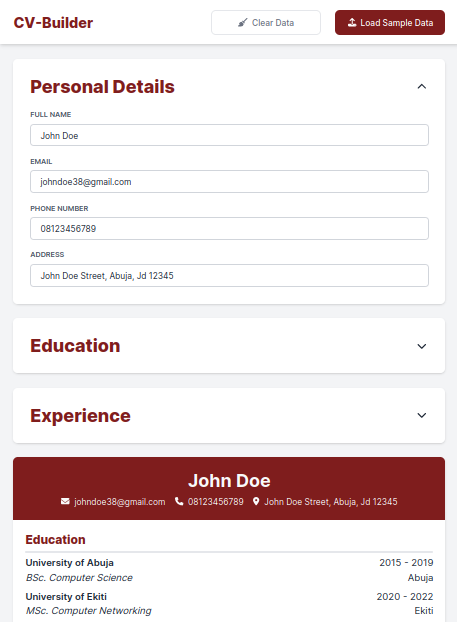

# CV-Builder

> Fully responsive web-app that allows the user to create a resume. 

This project was my first experience with React, and its main goal was to help me grasp the basics of React.

[Live Demo](www.exmample.com)

![Desktop project screenshot][cv-builder-screenshot-full]


## Built with



- React
- Vite
- TailwindCSS


## Installation
You can check out the live demo [here](www.exmample.com). If you wish to get a local copy running then follow the steps below:

### 1. Clone the Repository

```bash
git clone https://github.com/timknops/cv-builder.git
```

### 2. Dependencies
Navigate to the project's root directory and run:

```bash
npm install
```
This command will install all the necessary dependencies listed in the `package.json` file.

### 3. Start the application
Once the installation is complete, you can start the application using:

```bash
npm run dev
```
This will launch the development server, and you can view the app by opening http://localhost:5173 in your web browser.

Now you're all set to explore the project! If you encounter any issues or have questions, feel free to refer to the documentation or reach out for assistance.


[cv-builder-screenshot-full]: src/assets/cv-builder-screenshot-full.png
